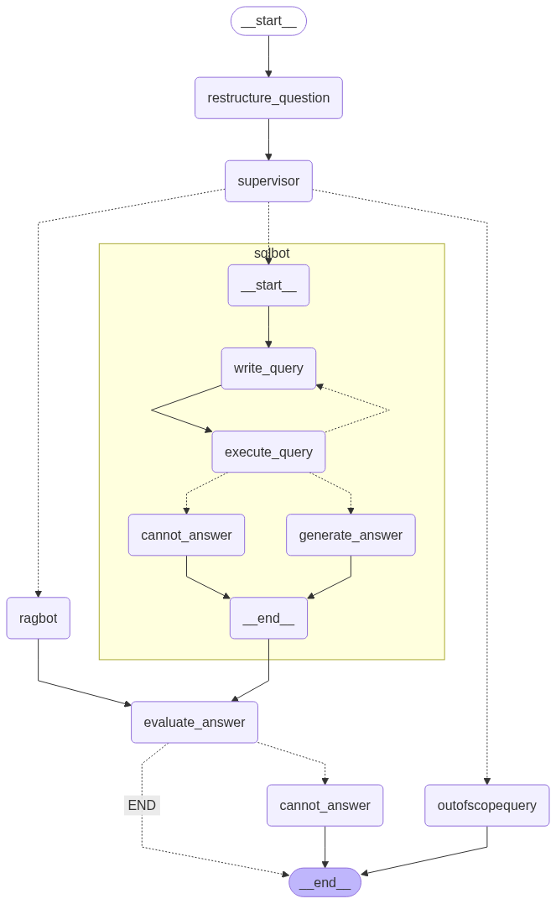
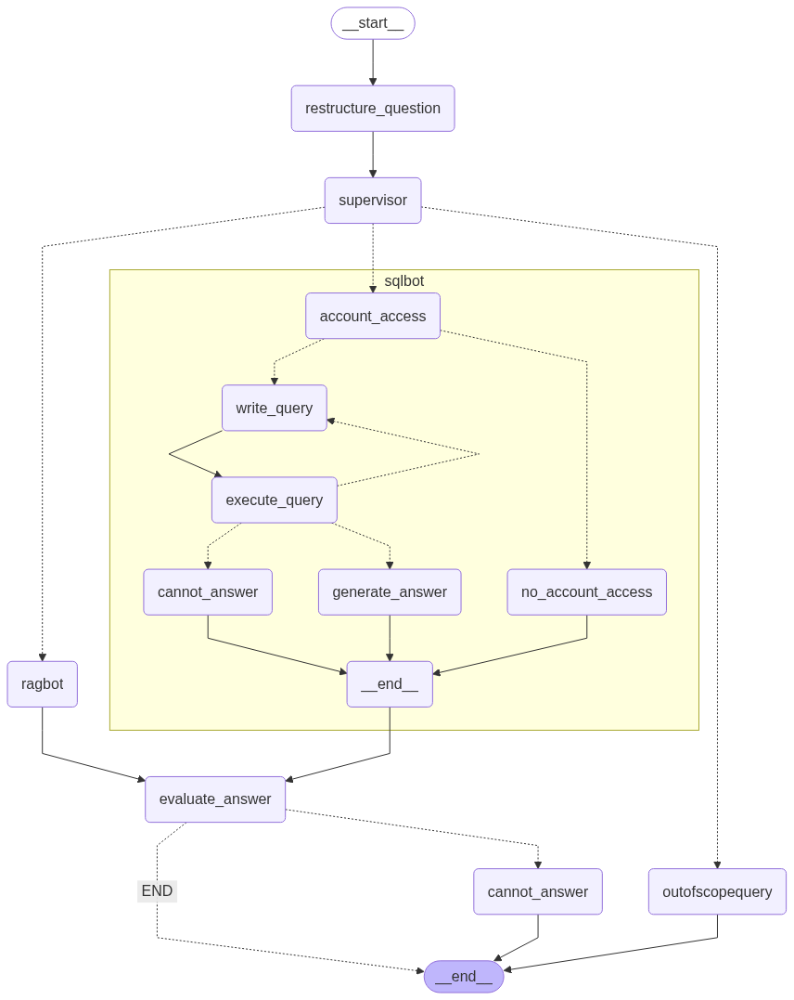

AI Assistant – Multi-Agent Workflow
## Author
**Kabilan Periaswami**

1. Overview
This project is an AI Assistant designed to handle both knowledge-based and transaction-based queries in a banking context. It uses a multi-agent workflow powered by LangGraph, LangChain, and Groq LLM APIs to:
    • Interpret user questions.
    • Decide which specialized agent should respond.
    • Validate the generated answer before returning it to the user.
The assistant supports two user personas:
    • Customer Persona – Limited data access, can only retrieve information about their own account, and can flag suspicious AI responses.

    • Manager Persona – Full database access, oversight of customer-flagged responses, and ability to approve or reject AI-generated answers.

2. Tech Stack
    • Programming Language: Python
    • AI Frameworks: LangGraph, LangChain
    • LLM Provider: Groq API – Model: llama3-70b-8192
    • Vector Database: FAISS (for RAG document storage and retrieval)

3. Architecture of AI Assistant
Manager Persona:

Customer Persona

4. Multi-Agent Workflow
The AI Assistant uses a supervisory multi-agent system where each query passes through multiple nodes:
Step 1: Question Restructure Node
    • Input: Summary of past conversation (not raw messages — to reduce prompt token size
    • Purpose: Reformulates the user’s query for clarity without changing semantic meaning.

Step 2: Supervisor Node
    • Evaluates the restructured query and decides the next step using a Pydantic BaseModel to constrain the routing decision to:

        ◦ "sqlbot" – If the question is about account transactions or database-related info.

        ◦ "ragbot" – If the question is about general knowledge, policies, or FAQs.

        ◦ "outofscopequery" – If the question is irrelevant, inappropriate, or unrelated (e.g., "I am sick today, help me

Step 3: Specialized Agent Execution
SQLBot Agent
    • Purpose: Answers questions requiring live database access
    • Workflow
        1. Account Access Node – Checks user persona and account scope. Customers can only query their own accounts; managers can query any
        2. Write Query Node – Generates SQL query using database schema and contextual information
        3. Execute Query Node – Runs SQL query
            ▪ If it fails, loops back to write_query (max 2 retries
            ▪ If it fails on the 3rd attempt, sends a default “cannot answer” response
        4. Generate Answer Node – Converts SQL result into a natural language answer
    • Error Handling: Prevents SQL injection, ensures security and accuracy
RAGBot Agent
    • Purpose: Answers questions from stored documents like bank policies, FAQs, and product descriptions
    • Workflow
        1. Documents are pre-processed → chunked → stored in FAISS vector database
        2. Relevant document chunks are retrieved based on query embeddings
        3. Answer is generated using the LLM with context from retrieved chunks
Out-of-Scope Node
    • Purpose: Handles irrelevant or inappropriate queries
    • Response: Returns a standard safe message (e.g., “I’m sorry, I can’t help with that.”).

Step 4: Answer Evaluation Node
    • Purpose: Checks if the generated answer is relevant and non-hallucinated.
    • Process: Uses an LLM-as-a-judge to validate the answer before sending it back to the user.

5. Manager–Customer Approval Flow
Customer Perspective:
    • When the AI Assistant gives a response, the customer can flag it if they suspect it’s wrong.
    • Flagged responses are sent to the Manager Dashboard.
Manager Perspective:
    • Managers see the flagged query-response pair.
    • They can:
        ◦ Mark as Correct
        ◦ Mark as Incorrect
        ◦ Add comments for clarification.
    • These decisions are sent back to the customer’s dashboard for review.
Purpose:
 This feedback loop ensures transparency and trust, giving customers a way to verify responses and providing managers with oversight.
 
### Credits

This AI Assistant was developed by Kabilan Periaswami, with additional contributions from Luis Mancio, Sanjiv Shrestha, Priyanjali Patel, Anika Rana, and Indu for integration and documentation support.
