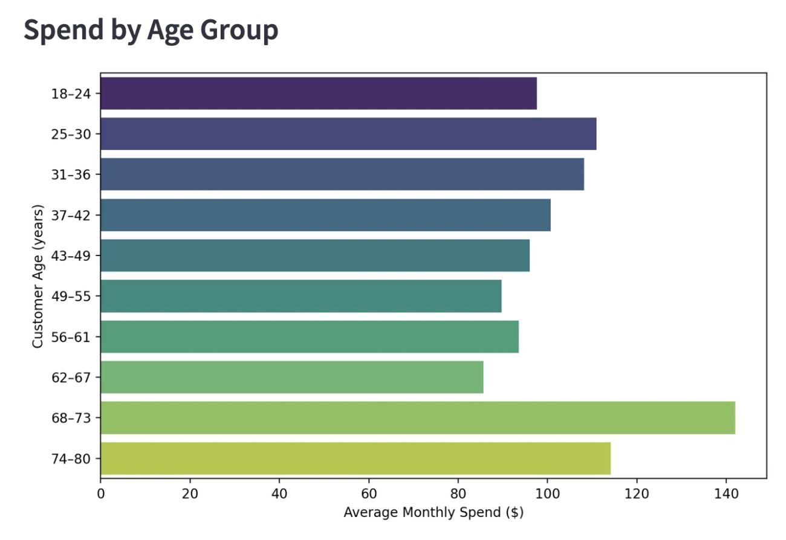
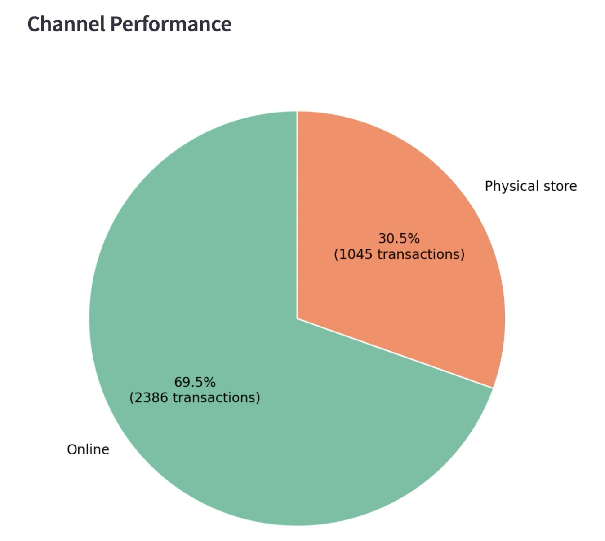
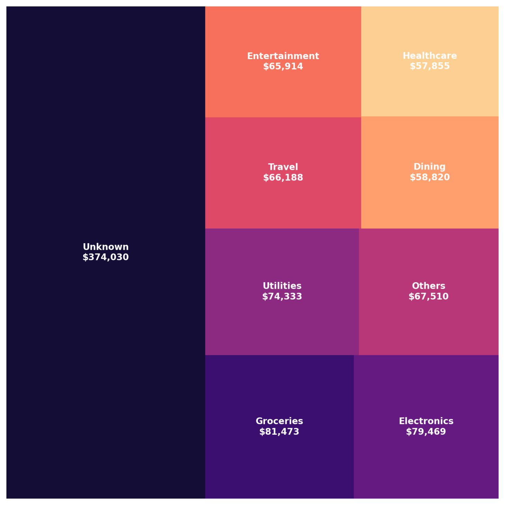
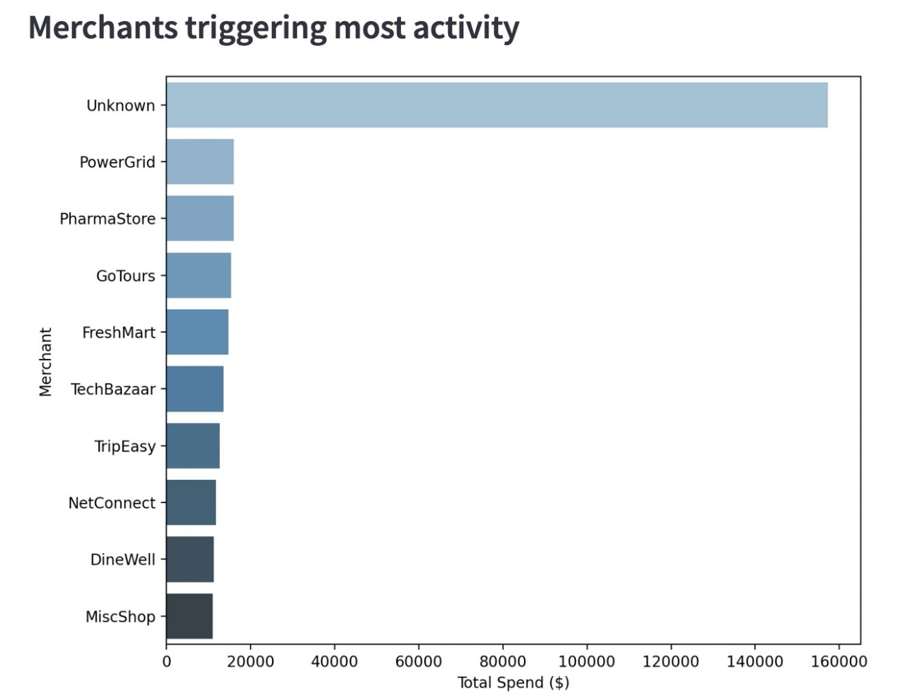
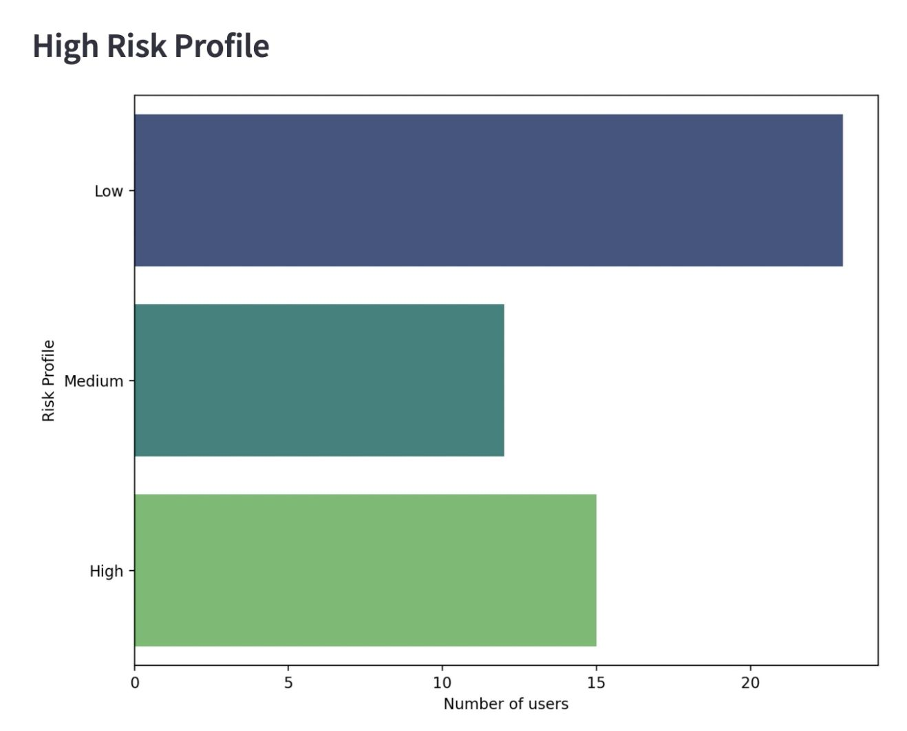
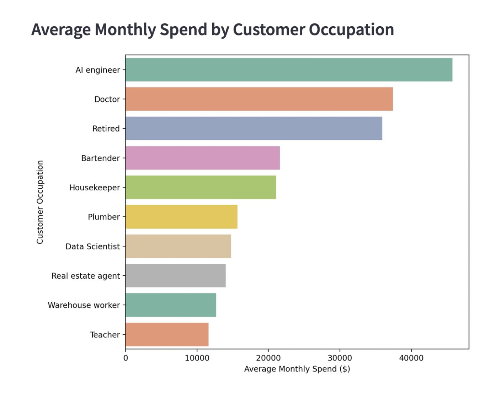

# KPI Manager Dashboard – Technical Documentation
## Author
**Luis Mancio**

Objective : The KPI Manager Dashboard is designed to provide bank managers with a clear, centralized view of key performance indicators (KPIs) related to customer behavior.  The tool enables graphical visualization of trends and patterns, supporting data-driven strategic decision-making. The interface includes dynamic filtering by month and year, ensuring all charts and metrics adapt to the selected period.

Components and Visualizations
    
   1. Spend Age and Group

        ◦ Description: Displays the average monthly spending of customers, grouped by age ranges.

        ◦ Age range: 18 to 80 years old, in 6-year intervals.

        ◦ Chart type: Grouped Bar Chart.

        ◦ Purpose: Identify spending trends across different age segments.
        
       

   2. Channel Performance

        ◦ Description: Shows the percentage and total number of transactions by channel (physical store vs. online).

        ◦ Chart type: Pie Chart.

        ◦ Purpose: Evaluate customer preferences between transaction channels.
        
        
       

   3. Spend by Category

        ◦ Description: A treemap visualization showing spending categories, with the size of each rectangle proportional to the total amount spent in that category.

        ◦ Chart type: Treemap.

        ◦ Purpose: Detect categories with the highest spending volume.
      
       

   4. Merchants Triggering Most Activity

        ◦ Description: Lists the top 10 merchants with the highest total spending from customers.

        ◦ Chart type: Grouped Bar Chart.

        ◦ Purpose: Identify strategic merchant partners and spending patterns.
       
       

   5. High Risk Profile

        ◦ Description: Shows the number of customers classified by risk profile (low, medium, high).

        ◦ Chart type: Grouped Bar Chart.

        ◦ Purpose: Monitor the distribution of customer risk profiles.
       
       
        

   6. Average Monthly Spend by Customer Occupation

        ◦ Description: Displays the average monthly spending of the top 10 occupations with the highest account activity.

        ◦ Chart type: Grouped Bar Chart.

        ◦ Purpose: Identify high-value professional segments for the bank.
        
      
 
### Credits

This KPI Manager Dashboard was developed by Luis Mancio, with integration and documentation support from Anika Rana, and Olajumoke Ojikutu.
